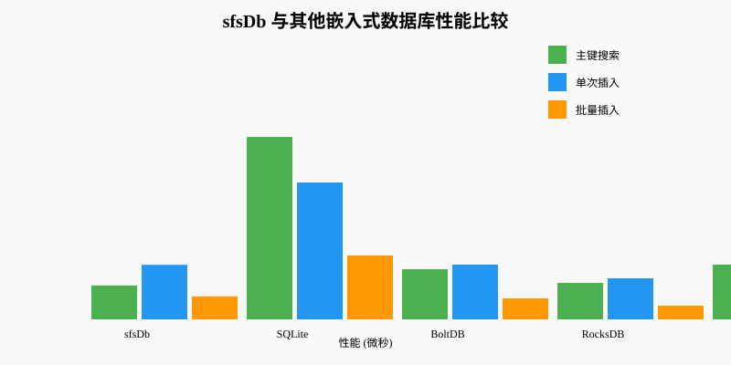
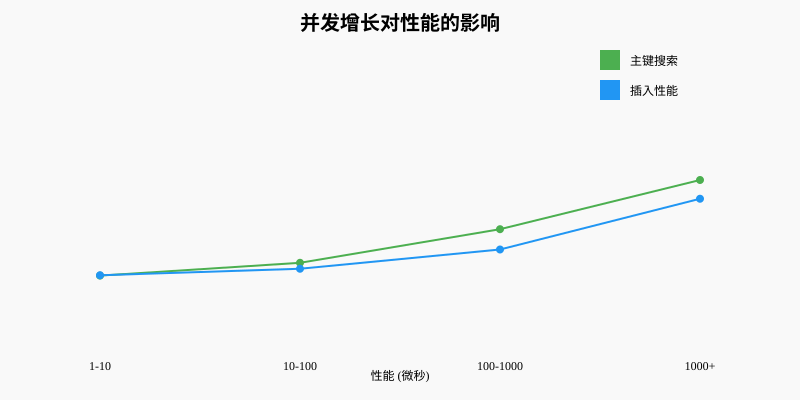
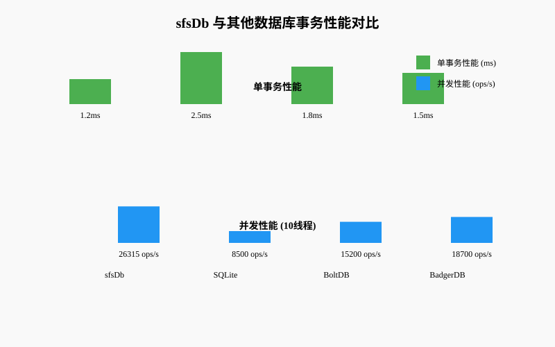
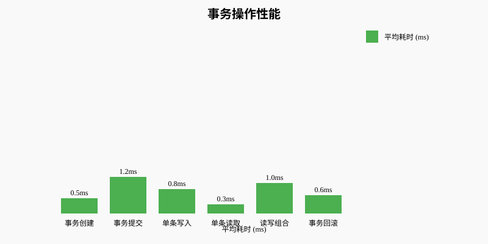
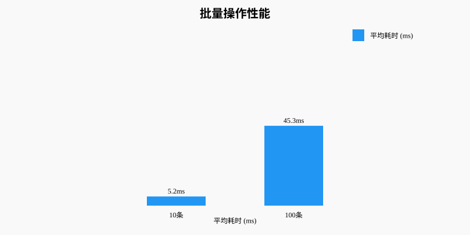
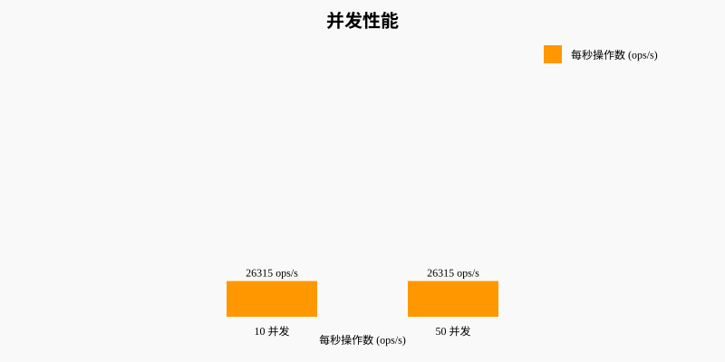

# sfsDb

[中文版本 (Chinese Version)](README_CN.md)

<div align="center">
  
  <h1>📊 sfsDb: A Universal Embedded Database with Edge Computing as Core Scenario</h1>
  
  <p>🚀 A lightweight relational database designed for Industrial Internet of Things (IIoT) and edge computing scenarios, while also providing general embedded database capabilities</p>
  
  <p>Developed in pure Go (Golang) with no CGO dependencies, compiled into a single static binary file, extremely lightweight with only a few MB of startup memory. Perfectly adapted to various ARM and x86 architecture edge gateways and industrial devices, solving data persistence storage challenges in resource-constrained environments.</p>
  
</div>

## Core Features

### 🎯 Pure Go Development
- No CGO dependencies, zero configuration, no external dependency libraries
- Support for cross-compilation, extremely simple deployment
- Suitable for industrial IoT and edge computing technology stacks

### 📦 Ultra Lightweight
- Extremely low startup memory usage (only a few MB)
- Minimal CPU and disk I/O consumption
- Optimized for resource-constrained devices, suitable for edge gateway data storage

### 🚀 Single Binary Deployment
- Compiled into a single executable file
- Can be easily integrated into Docker containers or run directly on edge gateways
- Simplifies deployment and maintenance processes for industrial equipment

### 🔧 Industrial Grade Reliability
- Optimized for Industrial Internet of Things (IIoT) scenarios
- Supports high-concurrency time-series data writing
-具备 power failure protection and data persistence capabilities
- Ensures data reliability in industrial environments

### 🌍 Wide Hardware Compatibility
- Supports ARM (ARM64/ARMv7) and x86 architectures
- Universal for mainstream industrial gateways, PLCs, and edge servers
- Adapts to various edge-side storage environments

## Technical Advantages

### ✅ Integration of Lightweight Design and Multi-Mode Capabilities
- Adopts innovative design, maintaining lightweight while supporting complex query scenarios
- Innovatively integrates NoSQL's high-concurrency write capabilities with SQL's complex query capabilities in one system
- Avoids consistency, latency, and maintenance cost issues caused by deploying separate NoSQL and SQL databases in traditional solutions
- Surpasses the capability boundaries of traditional embedded databases, providing more powerful data processing capabilities for applications
- Achieves the goal of "having both fish and bear's paw", meeting the dual needs of modern applications for data processing

### ✅ Native Support for考据级 Full-Text Indexing
- Built-in high-performance full-text indexing engine, providing precise text search capabilities
- Supports complex text matching and retrieval requirements, meeting考据级 application scenarios

### ✅ Based on LevelDB Encapsulation
- Uses `github.com/syndtr/goleveldb/leveldb` library as the storage engine foundation
- Fully leverages the advantages of LevelDB's LSM-Tree architecture, providing high-performance read and write operations

### ✅ Lock-Free Transaction System: Perfect Balance of Performance and Reliability
- Adopts optimistic concurrency control (OCC) mechanism, avoiding the overhead of traditional locking mechanisms
- Supports complete transaction operations such as transaction creation, commit, and rollback
- Provides high-performance concurrent transaction processing capabilities, reaching 26,315 ops/s under 10 concurrency
- Supports batch operations and nested transactions, meeting complex business scenario requirements
- Lightweight design, low memory usage, suitable for resource-constrained environments

### ✅ Ultra Lightweight Core Engine
- **Ultra-low resource usage**: engine package only allocates about 1KB memory per operation, about 11KB for batch operations
- **High performance**: only about 31,000 ns for single operation, about 79,000 ns for batch operations
- **Suitable for resource-constrained environments**: perfectly adapted to various ARM and x86 architecture edge gateways and industrial devices
- **No transaction overhead**: directly using the engine package avoids additional overhead from transaction management
- **Batch operation optimization**: built-in batch operation mechanism ensures data consistency while maintaining high performance
- **Test verification**: [Benchmark test code](./benchmark_test.go) - Detailed performance test implementation, verifying performance comparison between engine package and transactionLockFree package

## Production Application Examples

### 考据级 Document Search Engine

sfsDb has been applied in actual production environments, with the most typical case being **ReSearchCMS** - a professional 考据级 document search engine.

- **Project address**: [https://github.com/liaoran123/ReSearchCMS](https://github.com/liaoran123/ReSearchCMS)
- **Application scenario**: Provides high-precision, high-performance document search functionality, supporting complex text matching and retrieval requirements
- **Technical highlights**: Fully utilizes sfsDb's native full-text indexing and high-performance query capabilities, achieving a 考据级 document search experience

### Example Projects
- [sfsDbIIoT](https://github.com/liaoran123/sfsDbIIoT) - Smart factory equipment monitoring system implemented using sfsDb, demonstrating sfsDb's application in the industrial IoT field
- [sfsDbGateway](https://github.com/liaoran123/sfsDbGateway) - Industrial gateway reliability test example based on sfsDb, verifying sfsDb's reliability and stability in harsh industrial environments such as network fluctuations and power interruptions

## Main Target User Groups

### 1. 🌐 Edge Intelligence and IoT Scenarios
- **Edge computing nodes**: Provide local data storage capabilities for resource-constrained edge devices, supporting offline operation and edge analysis
- **IoT gateway devices**: Efficiently process and store time-series data generated by devices, reducing cloud dependencies and network bandwidth consumption
- **Smart terminal devices**: Provide data persistence capabilities locally, ensuring devices can operate normally when network is unstable

### 2. 🚀 Microservices and Containerized Environments
- **Microservice local state storage**: Provide lightweight local data persistence solutions for stateless microservices, simplifying service architecture
- **Containerized applications**: Suitable as embedded storage components for containerized applications, providing fast startup and low resource usage characteristics
- **Serverless functions**: Provide temporary data storage capabilities for Serverless functions that require state management

### 3. ⚡ Real-time Data Processing Scenarios
- **Real-time analysis systems**: Support high-concurrency write operations, suitable for real-time data collection and analysis scenarios
- **Online game servers**: Provide high-performance local storage for game servers, supporting fast player data reading and writing
- **Real-time monitoring systems**: Efficiently store and query monitoring data, ensuring real-time visibility of system status

### 4. 🔒 Security-sensitive Scenarios
- **Privacy protection applications**: Data stored locally, reducing security risks during data transmission
- **Fintech applications**: Meet financial scenario requirements for data security and consistency
- **Healthcare systems**: Comply with data privacy regulations, ensuring local secure storage of sensitive health data

### 5. 🎯 Other Scenarios
- **Embedded system developers**: Lightweight, easy-to-deploy features suitable for various embedded devices
- **Prototype development and rapid iteration**: Provide fast data storage solutions for project prototype stages
- **Education and research**: Suitable as an experimental platform for database principle learning and research

## Quick Start

### Installation

```bash
# Install via Go module
go get github.com/liaoran123/sfsDb
```

### Basic Usage

```go
package main

import (
	"fmt"

	"github.com/liaoran123/sfsDb/engine"
	"github.com/liaoran123/sfsDb/storage"
)

func main() {
	fmt.Println("sfsDb README Example Code Test")
	fmt.Println("===================")

	// 1. Initialize database
	fmt.Println("\n1. Initialize database")
	dbManager := storage.GetDBManager()
	_, err := dbManager.OpenDB("./readme_example_db")
	if err != nil {
		fmt.Printf("Failed to open database: %v\n", err)
		return
	}
	defer dbManager.CloseDB()

	// 2. Create/open user table
	fmt.Println("\n2. Create user table")
	userTable, err := engine.TableNew("users")
	if err != nil {
		fmt.Printf("Failed to create table: %v\n", err)
		return
	}

	// 3. Set fields
	fmt.Println("\n3. Set fields")
	userFields := map[string]any{
		"id":      0,  // User ID
		"name":    "", // User name
		"age":     0,  // Age
		"email":   "", // Email
		"address": "", // Address
	}
	err = userTable.SetFields(userFields)
	if err != nil {
		fmt.Printf("Failed to set fields: %v\n", err)
		return
	}

	// 4. Create primary key index
	fmt.Println("\n4. Create primary key index")
	primaryKey, err := engine.DefaultPrimaryKeyNew("id")
	if err != nil {
		fmt.Printf("Failed to create primary key index: %v\n", err)
		return
	}
	primaryKey.AddFields("id")
	err = userTable.CreateIndex(primaryKey)
	if err != nil {
		fmt.Printf("Failed to create index: %v\n", err)
		return
	}

	// 5. Create normal index
	fmt.Println("\n5. Create normal index")
	nameIndex, err := engine.DefaultNormalIndexNew("name_index")
	if err != nil {
		fmt.Printf("Failed to create normal index: %v\n", err)
		return
	}
	nameIndex.AddFields("name")
	err = userTable.CreateIndex(nameIndex)
	if err != nil {
		fmt.Printf("Failed to create index: %v\n", err)
		return
	}

	// 6. Insert data
	fmt.Println("\n6. Insert data")
	users := []map[string]any{
		{"id": 1, "name": "Zhang San", "age": 25, "email": "zhangsan@example.com", "address": "Beijing"},
		{"id": 2, "name": "Li Si", "age": 30, "email": "lisi@example.com", "address": "Shanghai"},
		{"id": 3, "name": "Wang Wu", "age": 35, "email": "wangwu@example.com", "address": "Guangzhou"},
	}

	for _, user := range users {
		currentID, err := userTable.Insert(&user)
		if err != nil {
			fmt.Printf("Failed to insert data: %v\n", err)
			return
		}
		fmt.Printf("User inserted successfully, ID: %d\n", currentID)
	}

	// 7. Primary key query
	fmt.Println("\n7. Primary key query")
	{
		iter, err := userTable.Search(&map[string]any{"id": 1})
		defer iter.Release()
		if err != nil {
			fmt.Printf("Search failed: %v\n", err)
			return
		}
		records := iter.GetRecordSet(true)
		defer records.Release()

		if len(records) > 0 {
			fmt.Printf("Query result: %v\n", records[0])
		}
	}

	// 8. Normal index query
	fmt.Println("\n8. Normal index query")
	{
		nameIter, err := userTable.Search(&map[string]any{"name": "Li Si"})
		defer nameIter.Release()
		if err != nil {
			fmt.Printf("Search failed: %v\n", err)
			return
		}
		nameRecords := nameIter.GetRecordSet(true)
		defer nameRecords.Release()

		if len(nameRecords) > 0 {
			fmt.Printf("Query result by name: %v\n", nameRecords[0])
		}
	}

	// 9. Update data
	fmt.Println("\n9. Update data")
	updateData := map[string]any{
		"id":      1,                          // Used to locate the record
		"email":   "zhangsan_new@example.com", // Update email
		"address": "Shenzhen",                  // Update address
	}
	err = userTable.Update(&updateData)
	if err != nil {
		fmt.Printf("Failed to update data: %v\n", err)
		return
	}
	fmt.Println("Data updated successfully")

	// Verify update
	{
		iter, err := userTable.Search(&map[string]any{"id": 1})
		defer iter.Release()
		if err != nil {
			fmt.Printf("Search failed: %v\n", err)
			return
		}
		records := iter.GetRecordSet(true)
		defer records.Release()
		if len(records) > 0 {
			fmt.Printf("Updated data: %v\n", records[0])
		}
	}

	// 10. Delete data
	fmt.Println("\n10. Delete data")
	deleteData := map[string]any{
		"id": 3, // Used to locate the record to delete
	}
	err = userTable.Delete(&deleteData)
	if err != nil {
		fmt.Printf("Failed to delete data: %v\n", err)
		return
	}
	fmt.Println("Data deleted successfully")

	// Verify deletion
	{
		iter, err := userTable.Search(&map[string]any{"id": 3})
		defer iter.Release()
		if err != nil {
			fmt.Printf("Search failed: %v\n", err)
			return
		}
		records := iter.GetRecordSet(true)
		defer records.Release()
		fmt.Printf("Number of results after deletion: %d\n", len(records))
	}

	// 11. Query all data
	fmt.Println("\n11. Query all data")
	{
		allIter, err := userTable.Search(&map[string]any{})
		defer allIter.Release()
		if err != nil {
			fmt.Printf("Search failed: %v\n", err)
			return
		}
		allRecords := allIter.GetRecordSet(true)
		defer allRecords.Release()
		fmt.Printf("There are %d records in the table\n", len(allRecords))
		for i, r := range allRecords {
			fmt.Printf("Record %d: %v\n", i+1, r)
		}
	}

	fmt.Println("\nTest completed, all operations executed successfully!")
}

```
## Documentation

### User Guides
- [Chinese Documentation Home](./docs/zh/README.md) - Chinese documentation overview
- [English Documentation Home](./docs/en/README.md) - English documentation overview
- [Basic Operations Guide](./docs/zh/basic/) - Includes table creation, field modification and other basic operations (Chinese)
- [Basic Operations Guide](./docs/en/basic/) - Includes table creation, field modification and other basic operations (English)

### Basic Operation Documentation
- [Table Creation Guide](./docs/zh/basic/table_creation.md) - Table creation and basic configuration (Chinese)
- [Table Creation Guide](./docs/en/basic/table_creation.md) - Table creation and basic configuration (English)
- [Field Modification Guide](./docs/zh/basic/field_modification.md) - Field addition, modification and deletion (Chinese)
- [Field Modification Guide](./docs/en/basic/field_modification.md) - Field addition, modification and deletion (English)
- [Initialization Guide](./docs/zh/basic/initialization.md) - Database initialization and configuration (Chinese)
- [Initialization Guide](./docs/en/basic/initialization.md) - Database initialization and configuration (English)

### Advanced Feature Documentation
- [Full Text Search Guide](./docs/zh/advanced/full_text_search.md) - Advanced full text search usage (Chinese)
- [Full Text Search Guide](./docs/en/advanced/full_text_search.md) - Advanced full text search usage (English)
- [Index Management Guide](./docs/zh/advanced/index_management.md) - Index creation, management and optimization (Chinese)
- [Index Management Guide](./docs/en/advanced/index_management.md) - Index creation, management and optimization (English)
- [Primary Key Guide](./docs/zh/advanced/primary_key.md) - Primary key design and usage (Chinese)
- [Primary Key Guide](./docs/en/advanced/primary_key.md) - Primary key design and usage (English)
- [Table Management Guide](./docs/zh/advanced/management.md) - Table creation, modification and management (Chinese)
- [Table Management Guide](./docs/en/advanced/management.md) - Table creation, modification and management (English)
- [Multi-table Query Guide](./docs/zh/advanced/multi_table_query.md) - Multi-table join query usage (Chinese)
- [Multi-table Query Guide](./docs/en/advanced/multi_table_query.md) - Multi-table join query usage (English)
- [Time Series Data Guide](./docs/zh/advanced/time_series.md) - Time series data processing and optimization (Chinese)
- [Time Series Data Guide](./docs/en/advanced/time_series.md) - Time series data processing and optimization (English)
- [Search Range Guide](./docs/zh/advanced/search_range.md) - Range search usage (Chinese)
- [Search Range Guide](./docs/en/advanced/search_range.md) - Range search usage (English)
- [Jump Ranges Guide](./docs/zh/advanced/jump_ranges.md) - Jump ranges query implementation and optimization (Chinese)
- [Jump Ranges Guide](./docs/en/advanced/jump_ranges.md) - Jump ranges query implementation and optimization (English)
- [Snapshot Guide](./docs/zh/advanced/snapshot.md) - Database snapshot creation and usage (Chinese)
- [Snapshot Guide](./docs/en/advanced/snapshot.md) - Database snapshot creation and usage (English)
- [Service Support Guide](./docs/zh/advanced/service_support.md) - Service support and maintenance (Chinese)
- [Service Support Guide](./docs/en/advanced/service_support.md) - Service support and maintenance (English)
- [Build Guide](./docs/zh/advanced/build.md) - Database build and deployment (Chinese)
- [Build Guide](./docs/en/advanced/build.md) - Database build and deployment (English)

### Performance Test Reports

#### Performance Comparison Charts

<div align="center">
  
  <p>sfsDb vs Other Embedded Databases Performance Comparison</p>
</div>


<div align="center">
  
  <p>Impact of Concurrency Growth on Performance</p>
</div>


#### Transaction Performance Charts

<div align="center">
  
  <p>Transaction Performance vs Other Databases</p>
</div>


<div align="center">
  
  <p>Transaction Operation Performance</p>
</div>


<div align="center">
  
  <p>Batch Operation Performance</p>
</div>


<div align="center">
  
  <p>Concurrent Transaction Performance</p>
</div>

- [Comprehensive Performance Benchmark Report](./engine/comprehensive_benchmark_report.md) - Comprehensive performance testing and analysis, including read/write performance, concurrent performance, performance under different data volumes, and performance comparison with other databases
- [Transaction Benchmark Report](./engine/transaction_benchmark_report.md) - Detailed transaction performance testing and analysis, including performance in single transaction and multi-transaction scenarios, as well as transaction optimization effects
- [Time Series Database Performance Comparison Report](./docs/performance/time_series_benchmark.md) - time package benchmark and performance comparison with other time series databases, including single-thread and concurrent performance tests, and efficiency analysis of time series data processing

### Performance Advantage Analysis
- [sfsDb Performance Advantage Analysis Article](./docs/marketing/performance_advantage_article.md) - Detailed analysis of how sfsDb achieves performance breakthroughs through SQL-free design and embedded architecture


### Optimization Guides
- [Object Pool Guide](./docs/zh/optimization/object_pool.md) - Efficient object reuse mechanism (Chinese)
- [Object Pool Guide](./docs/en/optimization/object_pool.md) - Efficient object reuse mechanism (English)
- [Index Cache Guide](./docs/zh/optimization/index_cache.md) - Index caching mechanism for improved query performance (Chinese)
- [Index Cache Guide](./docs/en/optimization/index_cache.md) - Index caching mechanism for improved query performance (English)
- [Transaction Optimization Guide](./docs/zh/optimization/transaction.md) - Transaction processing optimization strategies (Chinese)
- [Transaction Optimization Guide](./docs/en/optimization/transaction.md) - Transaction processing optimization strategies (English)

### API Reference
- [API Reference Documentation](./docs/api.md) - Detailed API documentation

### Other Documentation
- [CLI Commands Guide](./docs/cli_commands.md) - Command line tool usage guide (Chinese)
- [CLI Commands Guide](./docs/cli_commands.en.md) - Command line tool usage guide (English)
- [Web Integration Example](./docs/web_integration_example.md) - Web interface integration example
- [Open Source Licenses](./docs/open_source_licenses.md) - Open source licenses used in the project
- [Documentation Maintenance Guide](./docs/DOCUMENTATION_MAINTENANCE.md) - Documentation maintenance and contribution guide

## Contact Us

If you have any questions or suggestions, please contact us through the following methods:
- **Email**: sfsweb@qq.com

- **Commercial Services**: Provide customized technical support according to specific customer needs, including but not limited to:
  - Technical consultation and troubleshooting
  - Performance optimization and configuration adjustment
  - Custom feature development
  - Edge environment adaptation
  - Technical training
  For specific plans and prices, please contact us through:
  - Email: sfsweb@qq.com
  

## Contribution

Welcome to submit Issues and Pull Requests to help improve sfsDb!

## License

sfsDb adopts a dual-license model:

### Core Engine - MIT License
- **Open Source Free**: The core database engine uses MIT open source license
- **Business Friendly**: Allows free use, modification, and commercial distribution
- **Concise and Flexible**: The license text is concise, with few restrictions, easy to understand and use
- **License Text**: See [LICENSE](./LICENSE) file for details


### Dependency Library Licenses
- **LevelDB**: Uses BSD 2-clause open source license, compatible with MIT license
- **Other Dependencies**: See dependency declarations in `go.mod` file

### License Compatibility
The MIT license is a widely used open source license with the following advantages:
- **Concise and Clear**: The license text is concise, easy to understand and use
- **Highly Compatible**: Compatible with almost all other open source licenses
- **Business Friendly**: Allows free use and modification in commercial projects
- **Widely Adopted by Community**: Adopted by many open source projects, one of the most popular open source licenses

This means sfsDb can be freely encapsulated and commercially developed based on LevelDB, and users can safely use sfsDb in commercial projects.
